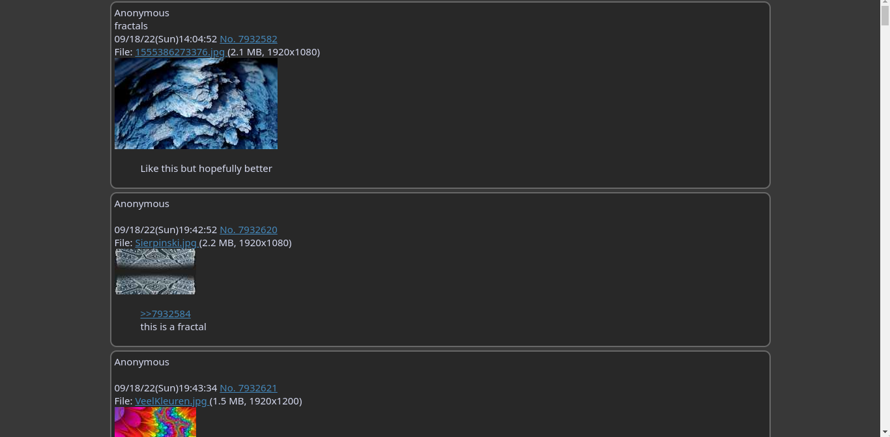
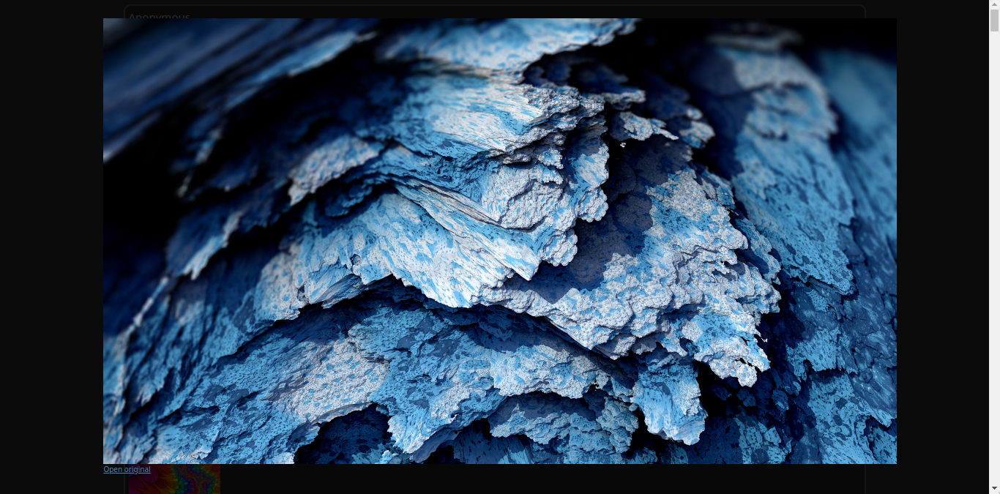

# Boarder
##### A minimal 4chan board hoarder

## Features
- simple text file to add new threads
- download all media + thumbnails and their post informations
- media and thumbnails on separate folders to enable browsing media alone
- creates json file of the data on the individual folders
- creates a static html file for each thread to view the thread as a whole
- Features of Static html
    - Better UI
    - Responsive
    - Clicking on media goes to preview mode (similar to discord web client)
    - Clicking on url opens media on new tab

## WIP
This is not fully baked, but still usable. If you experience any issues, 
see some improvement you think would be amazing, or just have some feedback 
for boarder, make an issue!

## Usage
Add `threads.txt` and `template.html` on the folder where you will be running boarder. 
The contents of the text file would be the list of threads you want to subscribe to.
The format to add a thread is `(board ID)_(thread No.)`.
```
// Anime Wallpaper
w_2185924
w_2223911

// Wallpaper General
wg_7934675
wg_7920373
```

## Screenshots
- Terminal View

- Normal View

- Preview Mode

